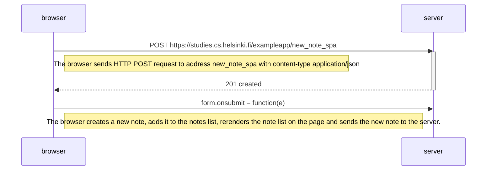

# fso-part0

```mermaid
  sequenceDiagram
    participant browser
    participant server

    browser->>server: POST https://studies.cs.helsinki.fi/exampleapp/new_note_spa
    activate server
    Note right of browser: The browser sends HTTP POST request to address new_note_spa with content-type application/json 

    server-->>browser: 201 created
    deactivate server

    browser->>server: form.onsubmit = function(e)
    note right of browser: The browser creates a new note, adds it to the notes list, rerenders the note list on the page and sends the new note to the server.
    
```
